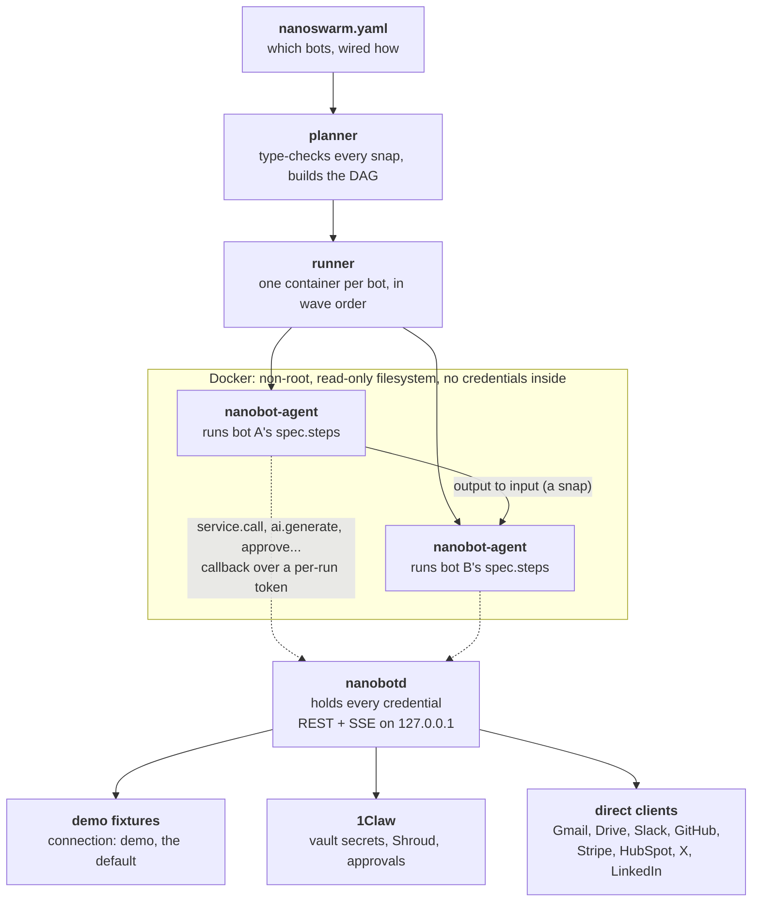

# Architecture

One design principle runs through every layer: **a bot container never gets
to touch a real credential, and a human never has to understand OAuth, an
API key, or a redirect URI to connect a service.**



Every step that needs the outside world — `service.call`, `ai.generate`,
`web.fetch`, `memory.*`, `approve`, `notify` — is a callback to `nanobotd`
rather than something the container does for itself. The container holds a
random per-run token and nothing else; the credentials never leave the
daemon. One interpreter (`internal/step`) runs every bot's steps whatever
its harness, so a bot behaves identically on `bare`, `llm` and `openclaw` —
see [harnesses.md](harnesses.md).

Every branch out of `nanobotd` is reachable from the exact same
`nanobot.yaml`, decided per-service by a single `connection:` field. A bot's
steps never know or care which branch actually ran
([connections.md](connections.md)).

Most bots do not need the container at all — see
[Docker is optional](#docker-is-optional) below.

## The pieces

**The bot contract** ([bot-contract.md](bot-contract.md)). A bot is any
container that reads `/run/inputs.json` (one already-defaulted,
already-validated JSON value per declared input port, mounted read-only
alongside the bot's own `nanobot.yaml`/`bot.md`/`prompts`/`fixtures` at
`/bot`), writes one file per declared output port under `/run/outputs/`, and
exits 0 on success. That is the whole interface.
`nanobots conform ./bots/<id>` proves a bot honors it without Docker or a
network, by running its `spec.steps` in-process against fixture data
(`internal/contract`).

**The step interpreter** (`internal/step`). One Go program, baked into every
harness image, that executes a bot's declared `spec.steps` in order —
`service.call`, `ai.generate`,
`transform.render`/`transform.now`/`transform.pick`, `web.fetch`,
`memory.get`/`put`, `approve`, `notify`. It runs identically against three
interchangeable backends (`step.Deps`):

- `DemoDeps` — fixture data from `bots/<id>/fixtures/*.json`, no network at
  all. What `nanobots conform` and the WebUI's demo mode use.
- `LiveDeps` — the real 1Claw Human API and Shroud, with a per-service
  `connection:` deciding whether a given call hits 1Claw, hits a direct
  client, does a plain `web.fetch`, or falls back to a fixture.
- `RemoteDeps` — what actually runs *inside* a container: every method is an
  HTTP callback to nanobotd, authenticated by a random token issued for that
  one run and rejected the instant the run ends. The container-side half of
  "no credential ever touches the container".

**The planner** (`internal/planner`). Parses a `nanoswarm.yaml`, resolves
each `bots[].use:`/`path:` reference to a real `nanobot.yaml`, type-checks
every `snaps[]` connection against the two bots' declared port types
(including dotted field paths into a `json`-typed port's own JSON Schema,
and numeric indices into a `list<T>` port), and builds and cycle-checks the
run DAG. `nanobots plan -f <swarm.yaml>` runs this standalone; the runner
runs it before every real execution; the visual builder and the AI composer
both run it live before a swarm is ever saved or shown.

**The runner** (`internal/runner`). Builds the two harness Docker images on
first use (`harness/bare` — distroless, no LLM, no browser, also used by the
`llm` harness since `ai.generate` is a callback rather than anything in the
container; `harness/openclaw` — the same interpreter plus headless Chromium
for HTML-to-PDF/PNG rendering), runs each bot in the planner's topological
order as `docker run --rm --read-only --user <non-root>`, mounts a
content-addressed blob store for `file`-typed ports, and streams every log
line to the run's SSE subscribers as it happens — including the exact moment
an `approve` step opens a gate ([approvals.md](approvals.md)).

**The 1Claw bridge** (`internal/oneclaw`). A real client for 1Claw's Human
API: API-key-for-bearer-token exchange, agent creation and update (including
`memory_enabled`, `shroud_config`), Shroud chat completions, vault
create/ensure, vault secret read/write (`PutSecret`/`GetSecret`, verified
against `@1claw/openapi-spec`), agent memory get/put, approval request/wait,
and a Browser Bridge client ([oneclaw-bridge.md](oneclaw-bridge.md),
[browser-bridge.md](browser-bridge.md)).

**Direct service clients** (`internal/google`, `internal/x`,
`internal/linkedin`, `internal/slack`, `internal/github`, `internal/stripe`,
`internal/hubspot`). Standalone REST clients for what 1Claw does not cover
natively, in two families.

Google, X and LinkedIn are OAuth flows. Google was built first with its own
hand-rolled PKCE and loopback client (no client secret, since 1Claw's OAuth
registry has no Gmail scopes and Browser Bridge is a dead end specifically
for Google — it drives a real, CDP-automated browser, and Google refuses
sign-in outright on any automation-controlled browser). X and LinkedIn came
later and share a small, provider-agnostic OAuth2+PKCE core
(`internal/oauth2pkce`) rather than duplicating that flow a second and third
time. X is a true public client like Google; LinkedIn is not — it requires a
client secret on the token exchange even with PKCE, and may issue no refresh
token at all, both documented in `internal/linkedin`'s package doc and
handled honestly in `internal/step/linkedin_live.go`.

Slack, GitHub, Stripe and HubSpot are simpler: a token that never expires,
so it is paste-once-into-a-vault-secret rather than an OAuth dance.
`internal/step/vault_token.go` is the shared "fetch a static secret from the
vault at most once per process" logic all four use.

## Docker is optional

34 of the 39 bots run in this process, because a container was not
protecting anything: their steps are a declared list run by this repo's own
interpreter, and every step that reaches the outside world already runs in
`nanobotd` rather than in the container (`internal/runner/inprocess.go`).

The 5 that still need Docker are the ones that drive a real headless browser
to render a PDF or a chart — `meeting-prep`, `quote-builder`,
`recap-emails-to-pdf`, `render-pdf`, `sheet-reporter`. The run log says
which path each bot took, every run.

## Repo layout

```
cmd/nanobotd/       Go daemon — REST+SSE API, binds loopback only
cmd/nanobots/       Go CLI — init, up, plan, run, conform, deploy, connect, schema
cmd/nanobot-agent/  the container entrypoint every harness image runs
internal/schema/    Nanobot/Nanoswarm Go types, YAML loading, JSON Schema generation
internal/planner/   resolves a swarm's bots, type-checks snaps, builds/cycle-checks the run DAG
internal/step/      the universal step interpreter + Demo/Live/Remote Deps backends
internal/contract/  the conformance runner (`nanobots conform`) and this repo's self-checking claims
internal/oneclaw/   real 1Claw Human API + Shroud + vaults/secrets + memory + agent CRUD + Browser Bridge
internal/google/    real Gmail/Drive/Sheets/Calendar OAuth + REST client (PKCE, no client secret)
internal/oauth2pkce/ shared, provider-agnostic OAuth2+PKCE core (used by internal/x, internal/linkedin)
internal/x/         real X (Twitter) OAuth2+PKCE client (post a tweet)
internal/linkedin/  real LinkedIn OAuth2+PKCE client (resolve member URN, post a share)
internal/slack/     real Slack Web API client (chat.postMessage)
internal/github/    real GitHub REST client (issues.list)
internal/stripe/    real Stripe REST client (invoices.list)
internal/hubspot/   real HubSpot CRM REST client (contact search/upsert)
internal/foundry/   the composer's escalation path — a sandboxed coding agent authors a new bot
internal/scheduler/ a real cron scheduler — polls examples/swarms/ and fires any swarm that is due
internal/runner/    Docker-backed orchestrator: builds harness images, runs bots, wires I/O
internal/remedy/    one place per known failure, and what to do about it
internal/api/       REST+SSE handlers, the builder/Connect/composer/foundry endpoints, the callbacks
internal/webui/     the built React app, embedded into the binary
internal/wiring/    shared startup wiring, so nanobotd and the CLI build it once
internal/daemon/    wires the above together; shared by cmd/nanobotd and `nanobots up`
harness/            Dockerfiles for the bot runtime images (bare, openclaw) and the foundry sandbox
schemas/            generated JSON Schema for Nanobot / Nanoswarm
bots/               one directory per nanobot (nanobot.yaml + instructions + fixtures)
examples/swarms/    one file per nanoswarm
web/                the WebUI — Vite + React + TypeScript + Tailwind + Radix
  src/pages/           LandingPage, BotLibrary, SwarmsPage, SwarmView, BuilderPage,
                       FoundryJobPage, RunsPage, RunDetail, SettingsPage
  src/components/      shared UI (run log, results, snap trail, YAML drawer, BotCard, ...)
  src/components/builder/  the visual builder's canvas, grouped palette, per-node inspector
  src/lib/uiMode.ts    basic/advanced mode hook (localStorage-backed)
docs/                this directory — one page per concept
```

## Running it for real

```sh
nanobots plan -f examples/swarms/morning-brief.yaml   # the DAG, type-checked
nanobots run  -f examples/swarms/morning-brief.yaml   # the runner, live
```

`plan` prints the wave order the runner will use, so the architecture above
is observable rather than only described ([parallelism.md](parallelism.md)).
